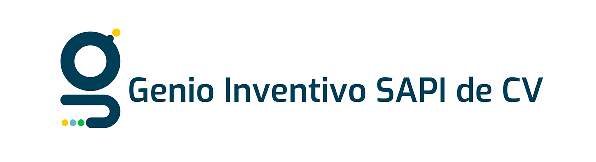

  

<h1 align="center">Genio Inventivo SAPI de CV</h1>

  Somos una empresa en innovación tecnológica con enfoque en soluciones innovadoras para un futuro más inteligente, eficiente y conectado.

  
  
  
  
  
  

---

## 💡 Sobre nosotros

En **Genio Inventivo** desarrollamos soluciones tecnológicas enfocadas en rendimiento, escalabilidad y valor real para las empresas.
Nos especializamos en sistemas backend robustos, aplicaciones web y desarrollo móvil.

---

## 🛠️ Stack tecnológico

  
  
  
  
  
  
  
  
  
  
  

  
  
  
  
  
  
  
  
  

---

## 📦 Proyectos

  
  
  
  
  
  

---

## ⚙️ Cómo trabajamos

* 🔀 Git Flow (`feature/*`, `develop`, `main`)
* 🔍 Code Review obligatorio
* 🚀 Integración continua (CI/CD)
* 🔐 Buenas prácticas de seguridad
* 📈 Desarrollo enfocado en escalabilidad

---

## 🎯 Enfoque

Priorizamos:

* Código limpio
* Arquitectura escalable
* Seguridad
* Mantenibilidad
* Buenas prácticas de desarrollo

---

## 📫 Contacto

  

---

  Hecho con 💻 por Genio Inventivo

